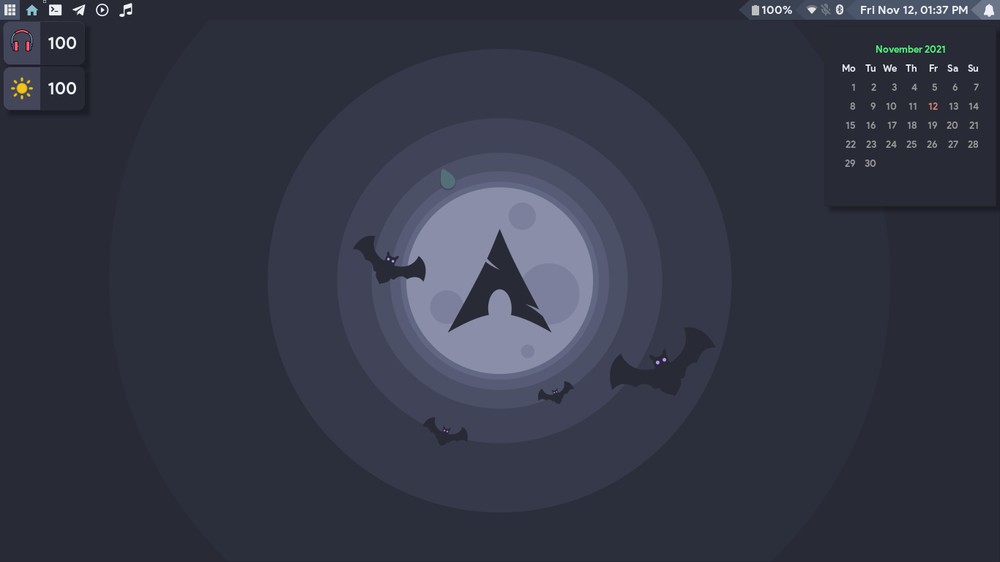
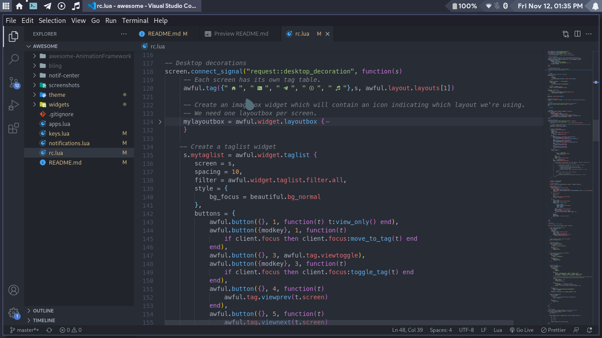
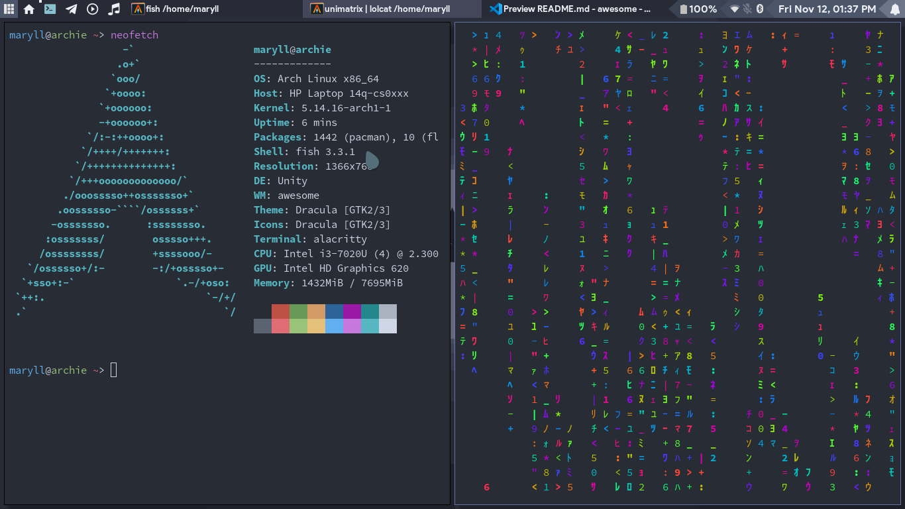

# DOTFILES
My config files for awesomewm

- WM : AwesomeWM
- Terminal : Alacritty
- Theme : Nord
- Wallpaper : [here](https://github.com/Maryll-castelino/Wallpapers/blob/master/cool-mountains.jpg)

## Screenshots




## Usage:

### Dependancies : 
- Nerd Font for the tag icons.
- Pactl for volume control
- xbacklight for brightness control

### Installation
1. cd into your .config folder
```
cd .config
```
2. backup your existing configuration
```
mv awesome myawesome-backup
```
3. clone this repository
```
git clone https://github.com/Maryll-castelino/dotfiles.git awesome
```
4. restart awesome

Report any issues you face and I'll be happy to address them😇
